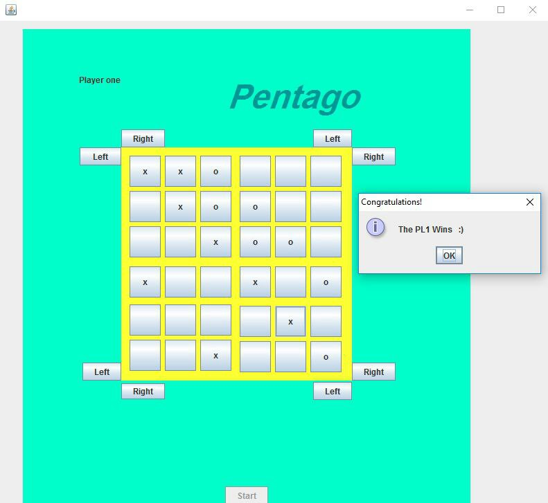

# Pentago-Game

My 5th project was in the "Advance Programming" course at spring 2016 when I was in the 2nd semester of my bachelor's at IAUSTB. Pentago is an abstract strategy game for two players with four 3×3 grids arranged into a larger 6×6 grid. This game reimplements the well known Connect 4 with a twist: After placing a marble, the player has to twist one of the grids by 90°, thus changing the board after every turn.Each player who can line five cell with its marble first, will win the game. The first player to get five marbles in a row wins. I used Java Swing to build its GUI.

|  | 
|:--:| 
| *Version One* |

I re-implemented this game and this version has more qualified GUI.

|  | 
|:--:| 
| *version Two* |

